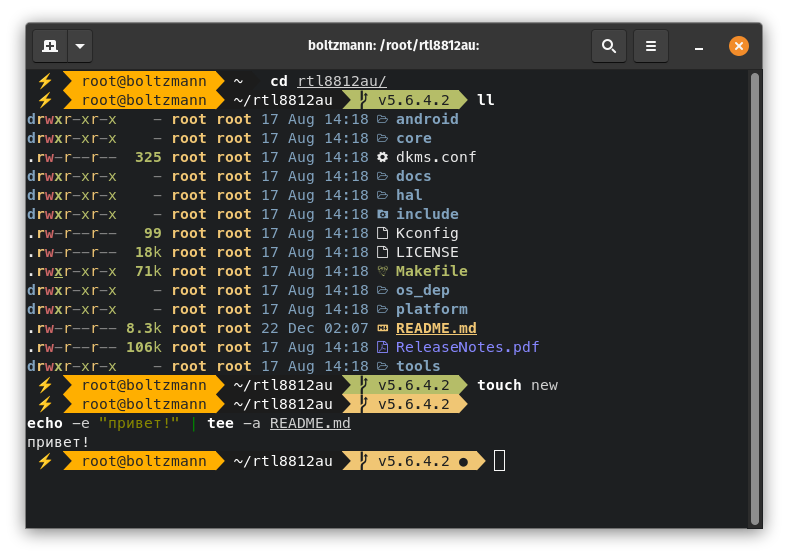

# Shell
This is the shell that I use daily and that I have configured with [fish](https://github.com/fish-shell/fish-shell) and the modified [shellder](https://github.com/simnalamburt/shellder) theme.

I consider it fast enough to use it in the small Raspberry Pi Zero

Tested on many debian based distros and manjaro

# Installation
It is NOT recommended to run the script with `sudo`, as this can lead to permission issues

Run the following script:

```sh
./install.sh
```
This will install [fish](https://github.com/fish-shell/fish-shell) with the modified [shellder](https://github.com/simnalamburt/shellder) theme, the plugin manager [fisher](https://github.com/jorgebucaran/fisher) and the [z](https://github.com/jethrokuan/z) plugin (this is located in [fish/configure.fish](fish/configure.fish))

This will also install [exa](https://github.com/ogham/exa) and [bat](https://github.com/sharkdp/bat)

[exa](https://github.com/ogham/exa) and [bat](https://github.com/sharkdp/bat) are provided as individual installable scripts
```sh
./install_only_exa.sh
./install_only_bat.sh
```

In case you don't want to make [fish](https://github.com/fish-shell/fish-shell) your default shell, i.e. invoke it only by typing `fish`, then you should install it as follows
```sh
ALREADY_USING_FISH=1 ./install.sh
```

# Screenshots




# Font

The font I use is `MesloLGS NF` included in the fonts directory

# Troubleshooting

In some cases it is necessary to log out and back in to see [fish](https://github.com/fish-shell/fish-shell) as the default shell

In cases of display problems of the characters that close the sections, that is, they do not look similar to the photos, check if a compatible font is installed and being used, such as `MesloLGS NF`

In some cases the appearance of the symbols may not be correct, for example a question mark may appear at the end of the prompt, this can be solved by installing the `locales-all` package

For example in debian based distros
```sh
sudo apt install locales-all
```

If you get the following error, probably you have an outdated version of [fish](https://github.com/fish-shell/fish-shell), for example 3.1.0, you could fix this in Ubuntu based systems with this [PPA](https://launchpad.net/~fish-shell/+archive/ubuntu/release-3)
```
fish: Unknown command: __fish_is_first_arg
```

# Gnome Terminal

The colors shown in the screenshots were obtained from [alacritty](https://github.com/alacritty/alacritty) and were exported to Gnome Terminal with the command
```sh
dconf dump /org/gnome/terminal/legacy/profiles:/ > gnome-terminal-profiles.dconf
```
so they can be imported by you as follows
```sh
dconf load /org/gnome/terminal/legacy/profiles:/ < gnome-terminal/gnome-terminal-profiles.dconf
```
**Important note, this command will replace your profiles! so backup them first**

and this should look like this


